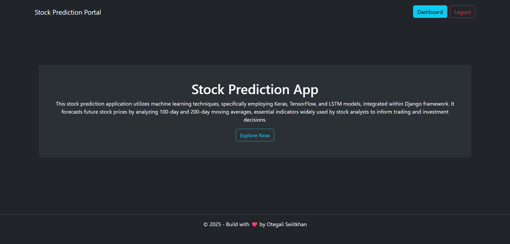
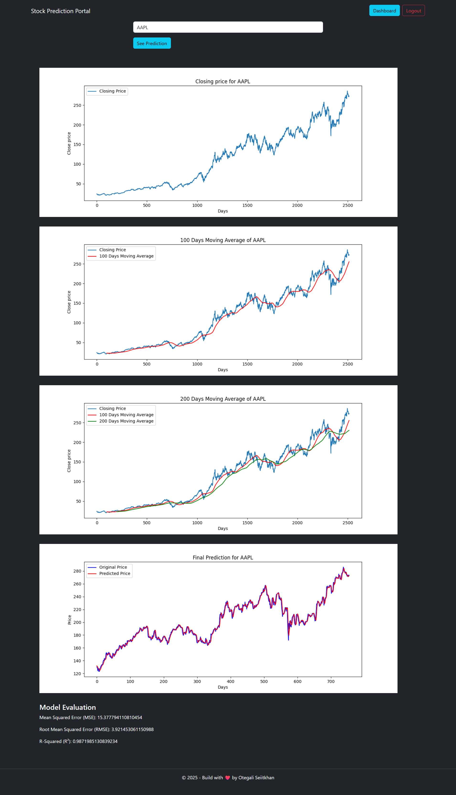

# 📈 Stock Prediction Portal

A full-stack web application for stock price prediction using **machine learning (LSTM neural networks)**, integrated with a **Django REST Framework backend** and a **React frontend**.  
This project combines web development and machine learning, demonstrating how ML models can be deployed in real-world applications.

---

## 🚀 Features

- User authentication (login/register)
- Predicts stock prices using **LSTM neural networks** (TensorFlow/Keras)
- Uses **100-day and 200-day moving averages** for analysis
- Interactive dashboard for viewing predictions
- RESTful API backend with Django
- Full integration of ML models into a web application

---

## 🛠 Tech Stack

**Backend:**

- Django REST Framework
- Python
- Keras / TensorFlow

**Frontend:**

- React
- Vite
- Axios

**Machine Learning & Data:**

- TensorFlow, Keras, Scikit-learn, NumPy, Pandas
- Matplotlib (data visualization)

---

## 📁 Project Structure

- backend-drf/ (Django REST API)
- backend-drf/requirements.txt (Python dependencies)
- frontend-react/ (React application)
- Resources/ (Jupyter notebooks and datasets for ML practice)
- README.md (Project documentation)

## 🏁 Getting Started

### Prerequisites

- [Docker Desktop](https://www.docker.com/products/docker-desktop/) (recommended, easiest setup)
- OR manually: **Python 3.12 or lower** (TensorFlow 2.20.0 has no Windows wheels for Python 3.13+ yet), Node.js 18+, npm

### Environment Variables

This project uses `.env` files for configuration, which are **not committed to git**. Create these yourself after cloning:

**`backend-drf/.env`**

```env
SECRET_KEY=your-django-secret-key
DEBUG=True
```

Generate a secret key with:

```bash
python -c "from django.core.management.utils import get_random_secret_key; print(get_random_secret_key())"
```

**`frontend-react/.env`**

```env
# add any Vite env vars here (must be prefixed with VITE_)
```

---

### Option 1: Run with Docker (recommended)

From the project root:

```bash
docker compose up --build
```

Add `-d` to run in the background. Stop with:

```bash
docker compose down
```

---

### Option 2: Run manually

**Backend (Django + DRF)**

```bash
cd backend-drf
python -m venv venv
venv\Scripts\activate      # Windows
# source venv/bin/activate  # macOS/Linux

pip install -r requirements.txt
python manage.py migrate
python manage.py runserver
```

Runs at `http://127.0.0.1:8000`

**Frontend (React + Vite)**

```bash
cd frontend-react
npm install
npm run dev
```

Runs at `http://localhost:5173`

---

## 🧠 Machine Learning Overview

- Preprocesses historical stock data
- Trains an **LSTM model** to learn patterns in stock price sequences
- Generates predictions for future stock prices
- Illustrates why **LSTM is ideal for time-series forecasting**

---

## 📸 Screenshots




---

## ⚙️ Setup

Dependencies are listed in `backend-drf/requirements.txt`.  
This project was built for **learning and demonstration purposes**.

---

## 📝 Usage

1. Register or login to your account
2. Navigate to the dashboard
3. View stock predictions
4. Analyze prediction results

---

## 📌 What I Learned

- Integrating ML models into a full-stack web application
- Building REST APIs for ML predictions
- Frontend-backend communication with React & Django
- Time-series forecasting with LSTM

---

## 📜 Certificate

Completed as part of **Full Stack Machine Learning with Django REST Framework & React** course.

---

## 📬 Contact

If you'd like to discuss the project or connect:

- LinkedIn: _linkedin.com/in/seiitkhan-otegali-870b6834a_

---

⭐ Explore the project and see ML in action!
